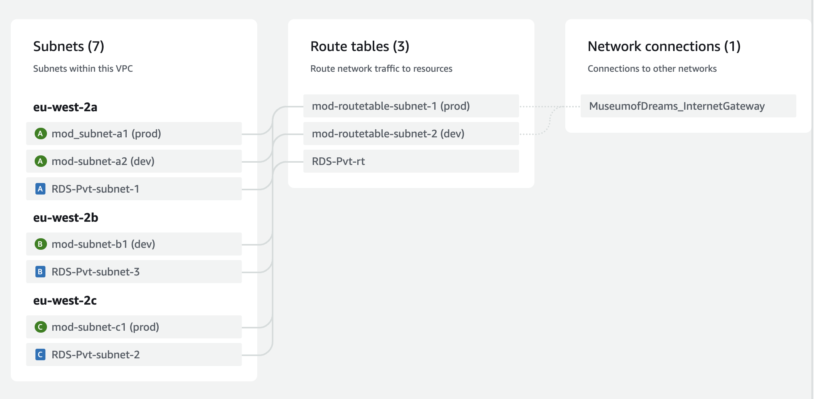

# Current Setup

Currently the AWS system is set up such that:

## VPC

There is one VPC called `MuseumofDreams`.
This has subnets across 3 availability zones (eu-west-2 a, b & c)
Below is a diagram of how the subnets are laid out.



Internet gateways allow the assigned routetables and their subnets to be exposed to the internet. Both `mod_routetable_subnet`s are exposed to the internet and are used for the EB apps and their load balancers, whilst the `RDS-Pvt-rt` is for the databases, shielding them from public internet access.

They have been distributed between dev and prod as shown because load balancers are required to be in at least 2 different availability zones and require subnets with internet gateways. The instances of the EB apps can have subnets with and without an internet gateway. The configuration for these will be covered in the ElasticBeanstalk section.


## IAM

The IAM configuration is that laid out in the [IAM Roles section](howtoSetupBase.md) of setting up. There is a role called `MuseumofDreams_EB_EC2`.
There is also a user called `mod_site`.

## RDS

There are two RDS instances, one for staging (`mod-mysql-dev-db`) and one for prod (`mod-mysql-ebdb-prod`).

They are almost identical in their setup aside from their availability zones and secondary security groups to connect with their respective environments - `rds-ec2-1` for production and `ec2-rds-1` for staging.


## ElasticBeanstalk

There is one EBS application - Museum of Dreams site and it has 2 environments - ...`env` which is production and ...`env-dev` for staging.

The workflow is that development is done on a feature branch and this gets merged into `development` and the CodePipeline for the staging site deploys these updates. When these have been reviewed and approved, they can be merged into `main` and the production CodePipeline will deploy a new version of production.

There are saved configurations for both dev and prod environments with load balancers (`mod prod config` and `dev scaling config`), which have most of the necessary selections, the exception being regarding security groups and subnets that will be covered below. You can also set these up with scaling single instances instead of load balancers and then change to load balancers later on (necessary for [SSL](awsSSL.md))

They should also both use the `moddbkey` for EC2 access and `MuseumofDreams_EB_EC2` for the EC2 instance profile.

### Configuration
**Production**

| Parameter name | Value/s |
|----|---|
|instance subnets | `mod-subnet-a1`, `mod-subnet-c1`, `RDS-Pvt-subnet-2`|
|additional ec2 security groups | `rds-ec2-1`|
|load balancer subnets | `mod-subnet-a1`, `mod-subnet-c1`|
---


**Staging**

| Parameter name | Value/s |
|----|---|
|instance subnets | `mod-subnet-a2`, `mod-subnet-b1`, `RDS-Pvt-subnet-1`|
|additional ec2 security groups | `ec2-rds-1`|
|load balancer subnets | `mod-subnet-a2`, `mod-subnet-b1`|
---

Use the saved configurations to launch instances if an environment needs to be terminated and spun up again. Make sure you detach the security groups before doing this (can be done from the security group console).


## Security Groups

Security groups allow traffic to pass between the instances attached to the SG and any others that have been defined in the incoming/outgoing rules. If traffic is allowed in via one rule it is also allowed out by that same rule, which means you only need to define it once.

Each EC2 instance has a default SG and a load balancer SG and these are automatically populated when an instance is launched. The additional groups are attached to the EC2 instances so that they can communicate with the MySQL databases.


## Restoring DB instances

If ever you need to spin up a new verison of the db, this should be done from *backups*, **not** snapshots as snapshots do not allow you to set an initial db name, which is necessary for EBS to connect to the RDS.

# Accessing the db through an EC2 shell

The following commands are important to run anytime you have to use the shell to manually run commands (this shouldn't be often!)

```
cd /var/app
source venv/staging-LQM1lest/bin/activate
cd current

export $(/opt/elasticbeanstalk/bin/get-config --output YAML environment |  sed -r 's/: /=/' | xargs)
```
